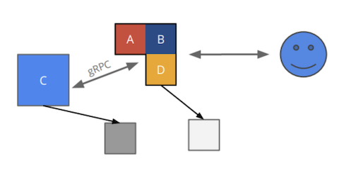

Latest version : https://bt.jfrog.io/ui/packages?name=Com.Bt.Rpc.%2A&type=packages
```xml
  <PropertyGroup>
    <Com.BtRpcV>1.0.1</Com.BtRpcV>
  </PropertyGroup>
```


# How To RPC  , Code First , Without Proto Contract 

Base on the [offical rpc SDK](https://github.com/rpc/rpc-dotnet):

* The Main Feauter is added that we can write Interface first , Without Proto Contract.
* This is Just Like a Local Nuget Service Invoke , but the service in effect is remote.
* The Server side  can be either Csharp or Java , both has  same Behavior.

There is a  [demo](./demo/) project. 

# 1. Declar you Interface  and DTO (Data Transfer objects)


* Just Add the ProjectReference [Com.Bt.Rpc.Contract]

```xml
<PackageReference Include="Com.Bt.Rpc.Contract" Version="1.0.0" />
// For java
api 'com.bt.rpc:rpc-api:1.0.0'
```

for example :

```csharp
using Com.Bt.Rpc.Model;
using Com.Bt.Rpc.Contract;

[RpcService]
public interface ITimeService
{
    Task<RpcResult<TimeResult>> Hello(TimeReq req);

    Task<RpcResult<string>> Ping();
}

public class TimeReq
{
    // support verify System.ComponentModel.DataAnnotations;
    [Required]
    [MaxLength(10)]
    public string Name { get; set; }

    public int Age { get; set; }
}
```
```java
// Java Example
@RpcService
public interface TimeService {
    RpcResult<TimeResult> hello(TimeReq req);
    RpcResult<String> ping();
}

@Data
public class TimeReq {
    @Size(max = 10,message = "too long!")
    private String name;
    private int age;
}
```

Convention & Limit  about the service define : 

* returnType must be `RpcResult<Data>` .
    - Csharp Side use a `Task` as wrap : `Task<RpcResult>`, Java side no need
    - `Data` can be any object , BUT Abstract/Interface Not Support
    - Do not use Enum as return Field(Input can), maybe not Compatibility when Upgrade. Use string/int instead.
    - date/time use [Unix Timestamp](https://en.wikipedia.org/wiki/Unix_time) (long type, language and Timezone  independent)
    - use customer `DTO` Object insteadOf simple object for Upgrade Friendly 
    - use List<Item> insteadOf Dictionary
* number of parameters at most 1 
* Remember add the `RpcService` annotation, then the SDK will recognition it as a Rpc Service.
* Streaming Method Not Support Current
  
Then publish this Nuget package to [bt.jfrog.io]  for the client side to reference.


# 2. Setup the Server

* Add the ProjectReference [Com.Bt.Rpc.Server] to your csproj

```xml
dotnet add package Com.Bt.Rpc.Server
<PackageReference Include="Com.Bt.Rpc.Server" Version="$(Com.BtRpcV)" />
```
  
* Implention the service 
  
* Configure Rpc in  `Startup.cs`

```csharp
using Com.Bt.Rpc.Server;

public void ConfigureServices(IServiceCollection services)
{
    //Scan service marked with  [RpcService] from config namespace Rpc.Server.ServiceScan
    services.ScanRpcService();
}

public void Configure(IApplicationBuilder app, IWebHostEnvironment env)
{
    app.UseEndpoints(endpoints =>
    {
        //publish  [RpcService]
        endpoints.PublishRpcService();
    }
}
```

* Enable Rpc Listening (default 50051) at `Program.cs`

```csharp
using Com.Bt.Rpc.Server;

webBuilder.UseRpc().UseStartup<Startup>();

```  
* all config in appsettings.json
  
```json
{"Rpc":{
    "Server":{
      "ServiceScan":"Com.Bt.Demo", // multi namespace use comma ,eg : a,b,c

      // Optional Below
      "Port":50051, 
      "Http1Port":80, // Also set up rest MVC
      "GlobalFilter": "Com.Bt.RpcSdk.LogFilter", // multi use comma
      "ServiceConfig":[{ 
        "Name":"Com.Bt.Demo.ITimeService",
        "Filter":"Com.Bt.RpcSdk.DumpClientHeaderFilter" // multi use comma
      }]
    }
  }
}
```

## 2.1 About The Rest Wrap For Rpc

```json
"Rpc":{
    "Server":{
      "EnableRestCall":true
    }
  }
```

if appsettings `Http1Port > 0`   and `EnableRestCall` , then POST to
`localhost:{Http1Port}/rpc/{service}/{method}` , the requestBody (json string) will convert to required argument.

``` shell
curl http://localhost:80/rpc/bt.demo.TimeService/hello -d '{"name":"RestRpc","age":18}' 
{"code":0,"data":{
  "Time": "Tue Apr 21 18:14:51 CST 2020 \t Java 2222  TimeReq(name=RestRpc, age=18)"
}}
```
Note: Here JsonNamingPolicy.`CamelCase` (same with namespace and method name) for compatibility with Java Side.

# 3. Test in the Client Side

* add  ProjectReference `Com.Bt.Rpc.Client` to your csproj.

```xml
dotnet add package Com.Bt.Rpc.Client
<PackageReference Include="Com.Bt.Rpc.Client" Version="$(Com.BtRpcV)" />
```

* for webapi
  
```csharp
public void ConfigureServices(IServiceCollection services)
{
    services.AddControllers();
    services.AddRpcClients(Configuration);
}

/// HelloRpcController.cs
[HttpGet]
public string Get()
{
    var res = _timeService.Hello(new TimeReq { Name = "Haha", Age = 18 }).GetAwaiter().GetResult();
    return JsonSerializer.Serialize(res.Data);
}
```

``` json
// appsettings.json
"Rpc": {
    "Client": {
      
      "Remote": [{
        "Host":"localhost",
        //"Port":50051,
        //"Https":false,
        "ServiceScan":"Com.Bt.Demo"
      }],

      // Optional Below
      "GlobalFilter": "RpcClientWeb.TestLogFilter",
      "ServiceConfig":[{
        "Name":"ITimeService",
        "Filter":"RpcClientWeb.TestLogFilter"
      }],
      "RpcChannelOptions": {
        "MaxSendMessageSize": 128
      }
    }
  }
```
then go to https://localhost:5001/hello for a Test.

you can list server apis by call MetaService :

``` csharp
IRpcMetaService metaService = .... ;
var meta = await metaService.ListApis();
Console.WriteLine("Service Provider By Remote:");
Console.WriteLine(meta.Data);


```
or iff server side EnableRestCall :

``` bash
curl -v  -X POST  http://localhost/rpc/bt.rpc.common.RpcMetaService/listApis  ""
```

demo code is here :  [RpcClientWeb](./demo/RpcClientWeb) 

* for Console App :  [RpcClient](./demo/RpcClient) 


# Exception Handler

## Soft Exception, Most case recommend .
* ServerSide : Just return a RpcResult with non-OK  Code and a error message(left data null)
* ClientSide : Check IsOk Before Use Data

## Hard Exception
* ServerSide : Throw a RpcException (Status/Runtime/Exception in Java Side) with your StatusCode or Other Exception(mapping to `Internal` code)
* ClientSide : Get a RpcException (StatusRuntimeException Java side, catch it or not )


# CI & CD

[jenkins-ci demo](http://jenkins-ci.bt.net/job/platform/job/rpc/job/rpc-demo-helm/)


[jenkins-cd rpc-demo-server](https://jenkins.bt.io/job/platform/job/rpc/job/rpc-demo-server/)


[jenkins-cd rpc-demo-client](https://jenkins.bt.io/job/platform/job/rpc/job/rpc-demo-client/)


## i. build.yaml
  [build.demo.yaml](../build.demo.yaml)
``` yaml
  - name: build
    command:
      - cd ./csharp
      - dotnet  build 
      - dotnet publish  demo/RpcServer/RpcServer.csproj  --no-restore -c Release  -o pub1
```
## ii. Dockerfile

just copy build dir from jenkins. use a var {TARGET} in build.yaml

```Dockerfile
FROM mcr.microsoft.com/dotnet/core/aspnet:3.1

ENV TZ=America/Phoenix
WORKDIR /app
ARG TARGET=./csharp/pub1
COPY  ${TARGET} .
```
## iii. hemlCharts
[hemlTemplates](./demo/charts/rpc/)

[rpc-demo-client](./demo/charts/rpc-demo-client/)

[rpc-demo-server](./demo/charts/rpc-demo-server/)

```yaml
app_name: rpc-demo-client
deployment:
  replicas: 2
  image:
    pullPolicy: IfNotPresent
    name: "bt-docker-local.jfrog.io/rpc-demo-client:latest"
  env:
    ASPNETCORE_ENVIRONMENT: Development
    Rpc__Client__Remote__0__ServiceScan : "Com.Bt.Demo,Com.Bt.Test"
    Rpc__Client__Remote__0__Host : "rpc-demo-server"
```


# Benefits and Weaknesses

## Benefits 


* Loose coupling between clients/server makes changes easy
* Easy for testing, inspection, and modification
* Significant Transport performance benefits over HTTP rest
* Developer Friendly 
    - Easy to understand, strict specification
    - deal with interface/poco , easy than http request
    - Eliminates debate and saves time to the best format of URLs/HTTP verbs/response codes.
    - Developer performence improve , No need to write client libraries
* Non Function Requirments  Built-in 
    - Deadline/timeouts and cancellation for resource usage limits
    - Distributed tracing( W3C over jager)
    - Monitor / Metrics Telemetry
    - Model Validation with DataAnnotations
    - Extensibility function, for example API Cache etc.

## Weaknesses

* Limited browser support
* Not human readable

but we will offer a Admin Web Console, to Manager And Test all the GRPC service(by browser).

## Recommended scenarios



* Microservices –  especially only internal and when one server needs to talk to the other.
* decomposing monolithic apps
* Network constrained environments – Power saving on mobile 
* Polyglot environments - both java and csharp
* When you don’t feel to write client libraries.