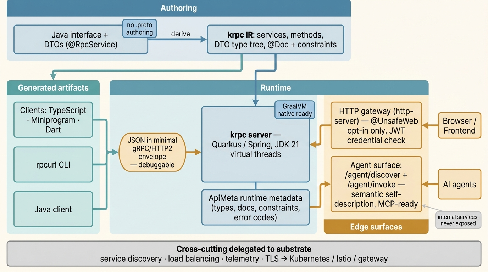

# KRPC

[English](README.md)

## KRPC 是什么

KRPC 是一个面向 JVM（JDK 21）的 contract-first、agent-native RPC 框架：你只写**一个 Java interface 加 DTO**——不用手写 `.proto`——框架就把这个契约同时变成 gRPC/HTTP2 服务、JSON HTTP API、TypeScript / Dart / Python 的类型化客户端，以及一个可选的 [MCP](https://modelcontextprotocol.io) 工具面，供 AI agent 直接调用。

Java interface 就是 source of truth。KRPC 负责传输、JSON 序列化、`jakarta` 校验、运行时元数据和客户端生成，服务作者只写业务逻辑——不写 schema、stub 或样板代码。

KRPC 依赖平台而不是重造平台：服务发现、负载均衡、可观测性、入口 TLS 和 mesh 策略交给 Kubernetes、Istio、gateway 或部署平台（[ADR-0001](docs/decisions/ADR-0001-repository-scope.md)）。它已用于电商、教育、本地生活等生产场景。

## 为什么 agent 时代需要它

agent 时代，服务不再只被其他服务调用——**agent 把服务当工具来调**。一个 KRPC Java interface 既是 RPC 契约，*当你选择开启时*又是 AI agent 调用的 MCP 工具面。同一个带注解的 interface 从一份定义出发，同时服务浏览器、服务间调用方、生成的 TS/Dart 客户端和 LLM agent，不需要单独的工具封装层。

其机制是 KRPC 的运行时自描述（[ADR-0004](docs/decisions/ADR-0004-agent-friendly-introspection.md)）。每个服务端都暴露 `ApiMeta`——服务与方法签名、完整 DTO 类型树、`@Doc` 文档、校验约束——由它支撑三个面向 agent 的 HTTP 接口：

- **`GET /agent/discover`**——以 JSON 返回 web 可见的 `ApiMeta`，让 agent 能内省一个运行中的服务（[agent 指南](docs/agent-guide.md)）。
- **`POST /agent/invoke`**——解析 `Service/method`，转发 JSON，并走*与 gRPC 调用完全相同*的凭证与过滤链。
- **`POST /mcp`**——一个手写的 [Model Context Protocol](https://modelcontextprotocol.io) 桥接（规范 `2025-06-18`，JSON-RPC 2.0 over Streamable HTTP；无第三方 SDK），其 `tools/list` / `tools/call` 由同一份 `ApiMeta` 生成（[SPEC §12.2](SPEC.md)）。

暴露是分层且**默认安全**的。服务不加 `@UnsafeWeb` 时是内部（隐藏）的；只有 `@UnsafeWeb(agentTool=true)`——或方法级 `@UnsafeWeb.AgentTool`——才把某个方法纳入 MCP 工具集，单独的 `@UnsafeWeb` 永远不会创建工具。工具属性默认 `false`，MCP 桥接本身也**默认关闭**（`rpc.server.mcp.enabled=false`，环境变量 `KRPC_MCP`），关闭的部署不产生任何新的 wire 表面。agent 路径上凭证校验永不被绕过。

> **AI agent？** 安装 [krpc skill](skills/krpc/SKILL.md) 并阅读 [agent 指南](docs/agent-guide.md)，通过 HTTP 发现并调用 KRPC 服务。

## 与 protobuf-gRPC 的区别

- **不手写 `.proto`。** Java interface 和它的 DTO *就是*契约（在 `RefUtils` 的方法发现处强制约束），没有单独需要同步的 IDL。
- **默认 JSON。** 传输用 gRPC/HTTP2，但默认编解码是 JSON，覆盖面更广。在 wire 上，负载走一个固定的 `InputProto`/`OutputProto` 信封（内部装 JSON 或字节），而不是每消息一套 protobuf schema（[SPEC §14](SPEC.md)）。
- **HTTP + gRPC 双接口。** gRPC gateway（`rpc.server.port`，默认 `50051`）和一个纯 HTTP 服务（`http.port`，默认 `8080`，提供 `/agent/*` 和 `/mcp`）跑在同一个进程里。
- **GraalVM native、JDK 21、virtual threads。** 通过 Quarkus 集成一等公民支持 native image（[SPEC §13](SPEC.md)）；阻塞型 handler 跑在 virtual thread 上（[ADR-0002](docs/decisions/ADR-0002-jdk21-virtual-threads.md)）。
- **gRPC 互通，诚实说明。** 因为 wire 用的是 KRPC 的通用信封，用 `.proto` 生成的标准 gRPC stub **不能**直接互通——你要通过 KRPC 生成的客户端、`rpcurl`、HTTP `/agent` 接口或 MCP 来调用。gRPC 路径没有运行时 schema 握手（`RPCURL-001`）；请用 `GET /agent/discover` 来内省。

## FAQ

**KRPC 兼容现有的 gRPC / protobuf 客户端吗？**
不直接兼容。KRPC 用 gRPC/HTTP2 做传输，但承载的是一个固定的 `InputProto`/`OutputProto` 信封（内部装 JSON 或字节），而不是每服务一套 protobuf 消息——所以用手写 `.proto` 生成的 stub 无法照原样调用 KRPC 服务。请通过 KRPC 生成的客户端（Java/TS/Dart/Python）、`rpcurl`、HTTP `/agent/invoke` 端点或 MCP 桥接来调用。

**需要 `.proto` 文件吗？**
不需要。普通业务 API 只需写一个返回 `RpcResult<Dto>` 的 Java interface 加 DTO；这个 interface 就是契约，也是客户端生成的来源。KRPC 只把 protobuf 当作内部 wire 信封，从不作为面向作者的 IDL。

**agent / MCP 客户端怎么调用 KRPC 服务？**
开启 MCP 桥接（`KRPC_MCP=true`），并给想暴露的方法加 `@UnsafeWeb(agentTool=true)`（或方法级 `@UnsafeWeb.AgentTool`）；MCP 客户端就能通过 `POST /mcp` 走 `tools/list` + `tools/call`。不说 MCP 的 agent 可以 `GET /agent/discover` 拿 JSON schema，再 `POST /agent/invoke` 调方法。两条路径都执行与 gRPC 相同的凭证校验。

**生成的 TypeScript / Dart 客户端给我什么？**
一个由同一份 interface + DTO 派生出的类型化客户端，前端或移动端可用精确的请求/响应类型（以及 `@Doc` 文档）调用方法——无需手写 HTTP、无需单独维护 schema。此外还有 Python、Go/k6、Java 和 `rpcurl` 客户端。

**能编译成 GraalVM native image 吗？**
可以，通过 `rpc-server-quarkus` 集成（SPEC §13）；quickstart 已验证能构建并以 native 二进制启动。引入库时注意文档记录的 native 反射坑（如 Caffeine 有界缓存）。

**它和 Spring gRPC / protobuf-gRPC 怎么比？**
KRPC 去掉了 `.proto`/IDL 这一步（interface 即契约），默认 JSON，并在 gRPC 传输之上加了 JSON HTTP 接口以及 agent/MCP 内省。经典 protobuf-gRPC 给你 schema-first 的跨语言契约和直接的 protobuf 互通；KRPC 用它换取 JVM 上 interface-first 的开发体验和 agent-native 接口。

**需要什么 JDK 和框架？**
JDK 21（virtual threads 是已支持的运行时特性，不是 roadmap 项）和 Gradle。运行时与框架无关，并提供 Quarkus（`rpc-server-quarkus`，含 native）和 Spring（`rpc-server-spring` / `rpc-client-spring`）的现成集成。

**怎么只把部分方法暴露为 agent 工具？**
暴露是 opt-in 且分层的。不加注解的服务保持内部；加 `@UnsafeWeb` 让浏览器/HTTP 能访问；在接口级加 `agentTool=true`，或在单个方法上加 `@UnsafeWeb.AgentTool`，就能把这些方法精确发布为 MCP 工具。默认全部关闭，且 MCP 桥接在未设置 `KRPC_MCP` 时保持关闭。

## 模块

- `rpc-api`：注解和共享 API 模型。
- `rpc-common`：序列化、上下文、过滤器、元数据和工具类。
- `rpc-client`：Java 客户端运行时。
- `rpc-server`：Java 服务端运行时。
- `rpc-client-spring`：Spring 客户端集成。
- `rpc-server-spring`：Spring 服务端集成。
- `rpc-server-quarkus`：Quarkus 和 native-image 集成。
- `http-server`：HTTP gateway 支持。
- `test-rpc-gen`：客户端代码生成示例。

命令行客户端 `rpcurl` 是独立的 Rust 项目，见[使用 rpcurl 调用](#使用-rpcurl-调用)。



## 环境要求

- JDK 21
- Gradle

当前版本：`1.0.3`（版本与支持矩阵见[支持政策](docs/support-policy.md)，编写规范见 [SPEC.md](SPEC.md)）。

```gradle
implementation "tech.krpc:rpc-api:1.0.3"
implementation "tech.krpc:rpc-client:1.0.3"
implementation "tech.krpc:rpc-server:1.0.3"
```

## 定义 API

在 API 模块中引入 `rpc-api`：

```gradle
plugins {
    id "org.kordamp.gradle.jandex" version "2.0.0"
}

dependencies {
    api "tech.krpc:rpc-api:1.0.3"
}
```

用 Java interface 定义服务：

```java
@RpcService
public interface DemoService {
    RpcResult<HelloResult> hello(HelloReq req);
}

public class HelloReq {
    @Doc("name")
    @NotBlank
    private String name;
}
```

API 规则：

- 返回值使用 `RpcResult<DTO>`。
- 每个方法只使用一个入参对象。
- 请求和响应都使用 DTO。
- 使用 `jakarta.validation` 做参数校验。
- 需要生成客户端文档的字段加 `@Doc`。
- 除非有强理由，API 契约里避免使用 `Map`。
- 响应 DTO 中尽量避免 enum 字段，降低客户端长期演进成本。

共享 API 包使用语义化版本发布，避免使用 `SNAPSHOT`。

## 实现服务端

引入 API 和 server runtime：

```gradle
dependencies {
    implementation project(":your-api")
    implementation "tech.krpc:rpc-server:1.0.3"
}
```

实现 interface：

```java
@ApplicationScoped
@Startup
public class DemoServiceImpl implements DemoService {
    @Override
    public RpcResult<HelloResult> hello(HelloReq req) {
        return RpcResult.ok(new HelloResult("hello " + req.getName()));
    }
}
```

## 使用 rpcurl 调用

`rpcurl` 可以从 [martin1847/krpc-crates](https://github.com/martin1847/krpc-crates/) 获取。

```bash
export KRPC_APP="https://example.com/demo"

rpcurl "$KRPC_APP/Demo/hello" -d '{"name":"krpc"}'
```

常用参数：

```text
-d, --data <DATA>      请求 JSON
-f, --file <FILE>      请求 JSON 文件
-t, --token <TOKEN>    Authorization: Bearer token
-c, --cookie <COOKIE>  Cookie header
-H, --header <HEADER>  自定义 header，例如 -H a=b
-v, --verbose          输出详细信息
```

## 错误处理

业务失败使用 soft error：

- 服务端：返回非 OK code 和 message 的 `RpcResult`。
- 客户端：读取 data 前先检查 `isOk()`。

系统错误、安全失败、参数校验失败和非预期运行时错误使用异常。

## 运行现有 Demo

仓库里已有一个集成 demo：`test-api` + `test-server`。

构建：

```bash
gradle :test-server:build -x test
```

启动：

```bash
gradle :test-server:quarkusDev \
  -Dquarkus.datasource.password=youshallnotpass \
  -Ddebug=false \
  --console=plain
```

调用：

```bash
rpcurl http://127.0.0.1:50051/test-server/Demo/hello \
  -d '{"name":"krpc","age":18}'
```

这是集成 demo，不是最小 quickstart 模板。它包含 MySQL、MyBatis 和 JWKS 相关配置；本地无网络时可能出现 JWKS 拉取 warning，但不影响 `Demo/hello` 调用。

## 客户端

已支持或配套支持 Dart、TypeScript、Python、Go/k6、Java 和 rpcurl。

## 项目治理

- 文档入口：[docs/INDEX.md](docs/INDEX.md)
- 仓库边界：[ADR-0001](docs/decisions/ADR-0001-repository-scope.md)
- JDK 21 和 virtual threads：[ADR-0002](docs/decisions/ADR-0002-jdk21-virtual-threads.md)
